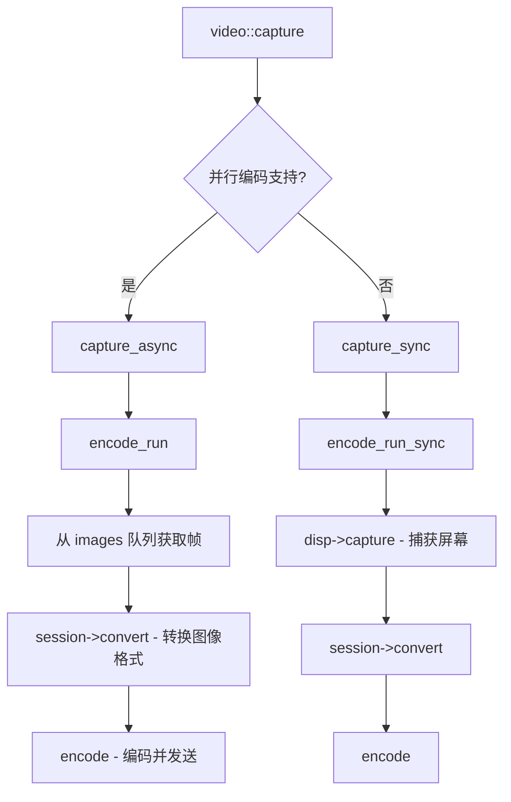

# Sunshine 视频黑帧替换修改方案

## 项目概述

本方案旨在修改 Sunshine 串流服务器，将视频输出流替换为持续的纯黑画面，以最大程度降低带宽消耗，同时确保音频传输及会话管理机制保持正常运行。

## 代码库分析结果

### 核心视频处理模块

| 文件 | 职责 |
|------|------|
| [`src/video.cpp`](src/video.cpp) | 视频捕获和编码的核心逻辑 |
| [`src/video.h`](src/video.h) | 视频相关数据结构和接口定义 |
| [`src/platform/common.h`](src/platform/common.h) | 平台抽象层，定义 `display_t`、`img_t` 等接口 |

### 视频处理流程



### 关键函数定位

1. **[`video::capture()`](src/video.cpp:2453)** - 视频捕获入口点
2. **[`encode_run()`](src/video.cpp:1942)** - 异步编码主循环
3. **[`encode_run_sync()`](src/video.cpp:2189)** - 同步编码主循环
4. **[`encode_session_t::convert()`](src/video.h:204)** - 图像格式转换接口

### 音频处理独立性验证

音频处理完全独立于视频：
- 音频在 [`src/audio.cpp`](src/audio.cpp) 中独立处理
- `audio::capture()` 在独立线程运行
- 音频和视频通过 `mail` 消息队列机制独立通信
- 修改视频流程不会影响音频传输

---

## 修改方案

### 推荐方案：修改编码循环

在 `encode_run()` 函数中，跳过从捕获队列获取实际图像的步骤，始终使用预先分配的黑帧进行编码。

#### 修改位置

**文件**: [`src/video.cpp`](src/video.cpp)
**函数**: `encode_run()` (第 1942-2051 行)

#### 修改前代码逻辑

```cpp
// 当前逻辑：从捕获队列获取实际帧
if (auto img = images->pop(max_frametime)) {
    frame_timestamp = img->frame_timestamp;
    if (session->convert(*img)) {
        BOOST_LOG(error) << "Could not convert image"sv;
        return;
    }
}
```

#### 修改后代码逻辑

```cpp
// 修改后：始终使用黑帧，不获取实际捕获的图像
// 黑帧已在初始化时通过 disp->dummy_img() 生成并转换
// 此处跳过图像获取，直接进行编码
```

### 具体代码修改

#### 修改点 1：`encode_run()` 函数

**位置**: 第 1996-2050 行

**修改说明**:
1. 在函数开始时，使用 `dummy_img` 初始化黑帧（已有逻辑）
2. 在编码循环中，跳过从 `images` 队列获取帧的步骤
3. 保持 IDR 帧请求处理逻辑不变
4. 保持编码和发送逻辑不变

```cpp
// 修改后的 encode_run 函数核心循环
while (true) {
    // 检查退出条件
    if (shutdown_event->peek() || !images->running() || (reinit_event.peek() && frame_nr > 1)) {
        break;
    }

    bool requested_idr_frame = false;

    // 处理参考帧失效请求
    while (invalidate_ref_frames_events->peek()) {
        if (auto frames = invalidate_ref_frames_events->pop(0ms)) {
            session->invalidate_ref_frames(frames->first, frames->second);
        }
    }

    // 处理 IDR 帧请求
    if (idr_events->peek()) {
        requested_idr_frame = true;
        idr_events->pop();
    }

    if (requested_idr_frame) {
        session->request_idr_frame();
    }

    // === 关键修改：不再从 images 队列获取帧 ===
    // 黑帧已在初始化时通过 dummy_img + session->convert 加载
    // 直接进行编码，无需获取新帧
    
    // 编码当前帧（黑帧）
    if (encode(frame_nr++, *session, packets, channel_data, {})) {
        BOOST_LOG(error) << "Could not encode video packet"sv;
        return;
    }

    session->request_normal_frame();

    // 帧率控制：保持原有时序
    std::this_thread::sleep_for(max_frametime);
}
```

#### 修改点 2：同步编码模式 `encode_run_sync()`

**位置**: 第 2189-2338 行

**修改说明**: 同样跳过实际帧的获取和转换，使用黑帧。

---

### 黑帧生成机制

项目已有黑帧生成实现：

1. **`display_t::dummy_img()`** - 平台相关的黑帧初始化
2. **`av_image_fill_black()`** - FFmpeg 函数，填充黑色像素

现有代码已在编码会话初始化时使用黑帧：

```cpp
// video.cpp 第 1985-1994 行
{
    // Load a dummy image into the AVFrame to ensure we have something to encode
    // even if we timeout waiting on the first frame.
    auto dummy_img = disp->alloc_img();
    if (!dummy_img || disp->dummy_img(dummy_img.get()) || session->convert(*dummy_img)) {
        return;
    }
}
```

### 带宽优化效果

使用纯黑画面的带宽优势：

| 场景 | 预估带宽节省 |
|------|-------------|
| 静态黑帧 | 90-99% |
| 低复杂度场景 | 80-95% |

原因：
1. 黑帧在视频编码中具有极高的压缩效率
2. H.264/HEVC/AV1 编码器对均匀颜色区域使用极少的比特
3. 帧间预测几乎不需要残差数据

---

## 实施步骤

### 步骤 1：修改 `encode_run()` 函数

修改 [`src/video.cpp`](src/video.cpp) 中 `encode_run()` 函数的编码循环，跳过帧获取步骤。

### 步骤 2：修改 `encode_run_sync()` 函数

修改同步编码模式下的帧处理逻辑。

### 步骤 3：添加配置选项（可选）

在配置中添加开关，允许用户选择是否启用黑帧模式：

```cpp
// 在 config.h 中添加
extern bool enable_black_frame_mode;
```

### 步骤 4：测试验证

1. 验证视频输出为纯黑画面
2. 验证音频传输正常
3. 验证会话管理正常（连接、断开、重连）
4. 测量带宽使用情况

---

## 风险评估

| 风险 | 影响 | 缓解措施 |
|------|------|----------|
| 帧率控制异常 | 视频流不稳定 | 保持原有时序逻辑 |
| 客户端超时 | 连接断开 | 确保 IDR 帧正常发送 |
| 内存泄漏 | 长时间运行问题 | 保持现有资源管理逻辑 |

---

## 文件修改清单

| 文件 | 修改类型 | 说明 |
|------|----------|------|
| `src/video.cpp` | 修改 | 修改 `encode_run()` 和 `encode_run_sync()` |
| `src/config.h` | 可选新增 | 添加黑帧模式配置选项 |
| `src/config.cpp` | 可选新增 | 配置选项实现 |

---

## 总结

本方案通过最小化修改 `video.cpp` 中的编码循环逻辑，实现视频输出替换为纯黑画面的目标。修改点集中、影响范围可控，不会影响音频传输和会话管理机制。
